# 🌟 Kasper Template (HTML5 & CSS3)

> A modern and responsive website template built with HTML5 and CSS3, ideal for personal portfolios, agencies, or businesses.

---

## 🔗 Live Demo

[View Demo](https://youssefadel170.github.io/Kasper-Template/)

---

## 🖼️ Screenshots

### Desktop

| Home                          | About                           | Services                              |
| ----------------------------- | ------------------------------- | ------------------------------------- |
| 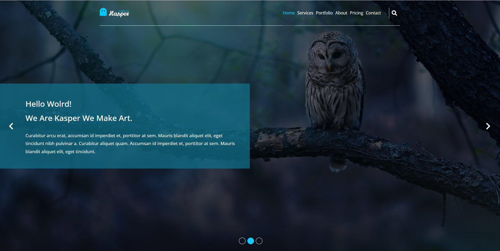 | 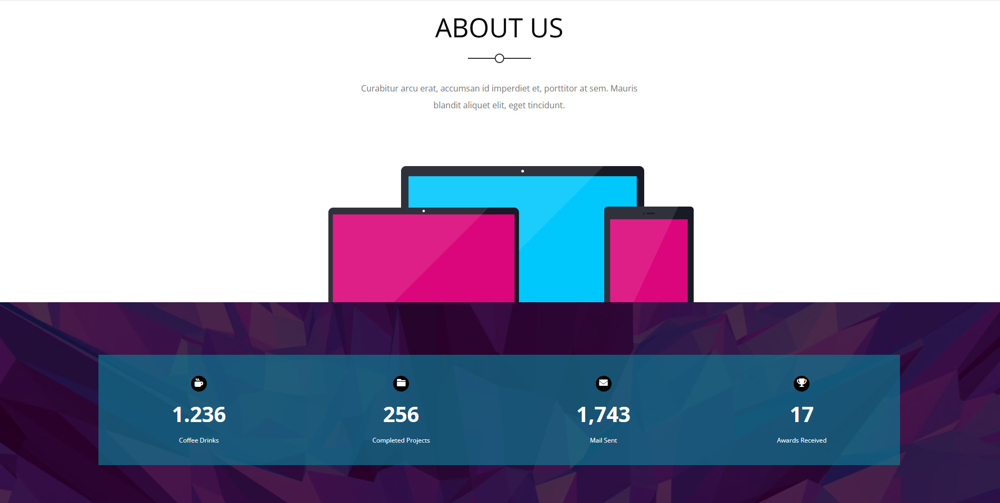 | 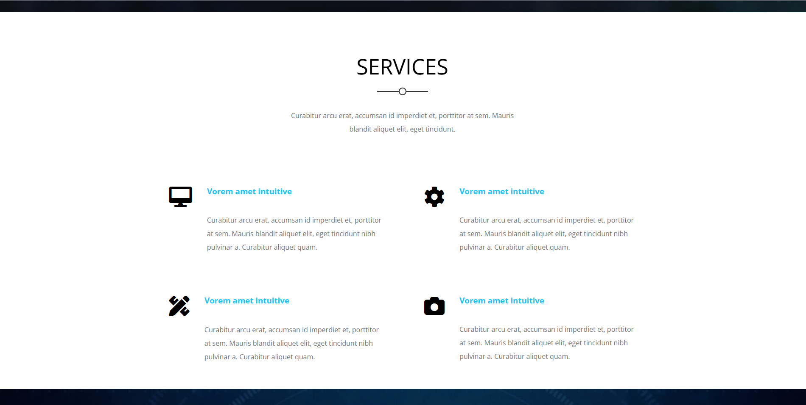 |

| Portfolio 1                                 | Portfolio 2                                 | Design                            |
| ------------------------------------------- | ------------------------------------------- | --------------------------------- |
| 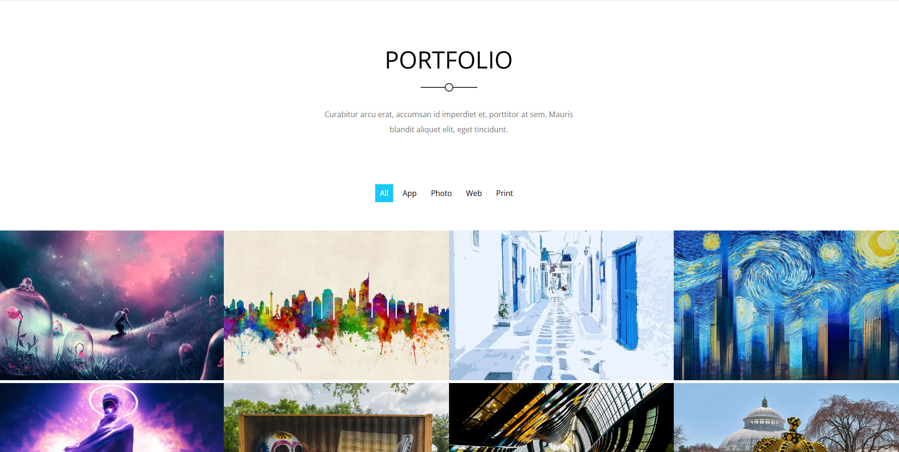 | 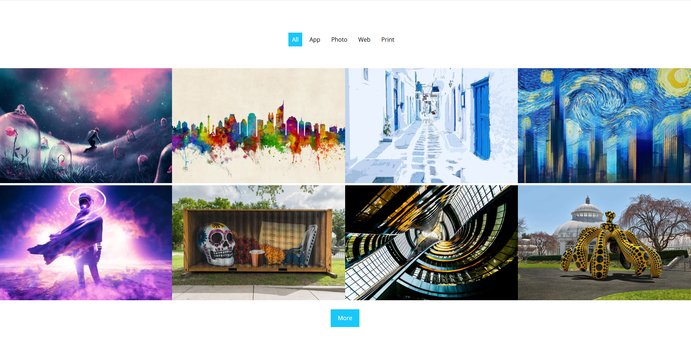 | 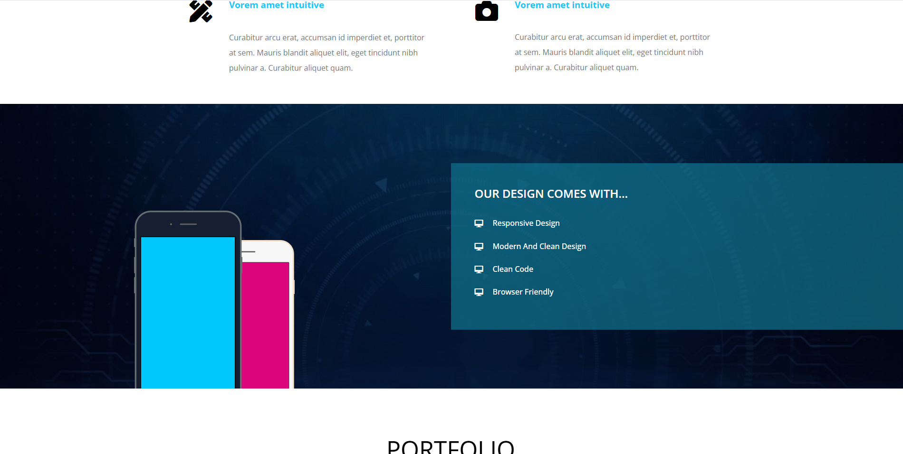 |

| Pricing Plan                             | Sample Video                           | Testimonials                                  |
| ---------------------------------------- | -------------------------------------- | --------------------------------------------- |
| 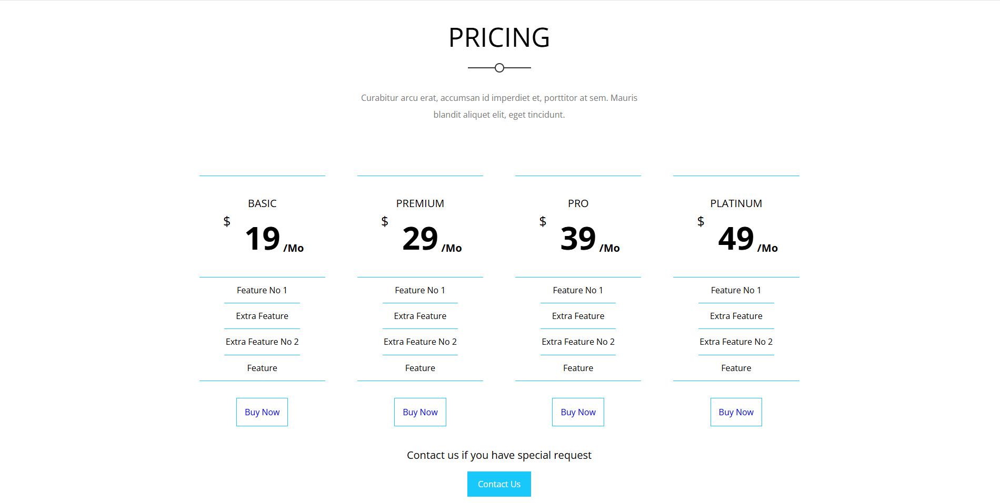 | 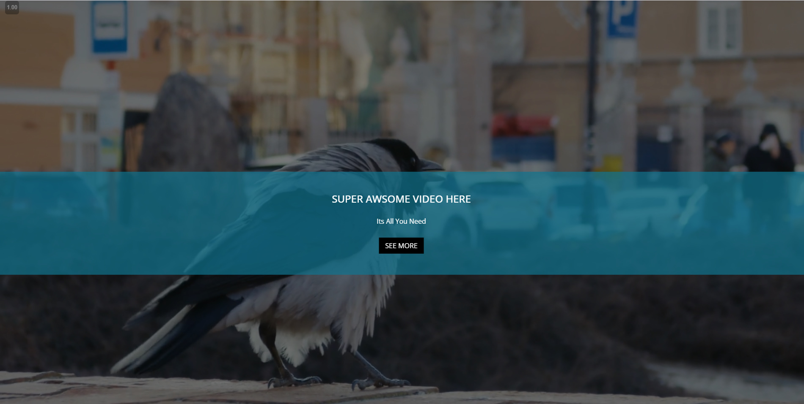 | 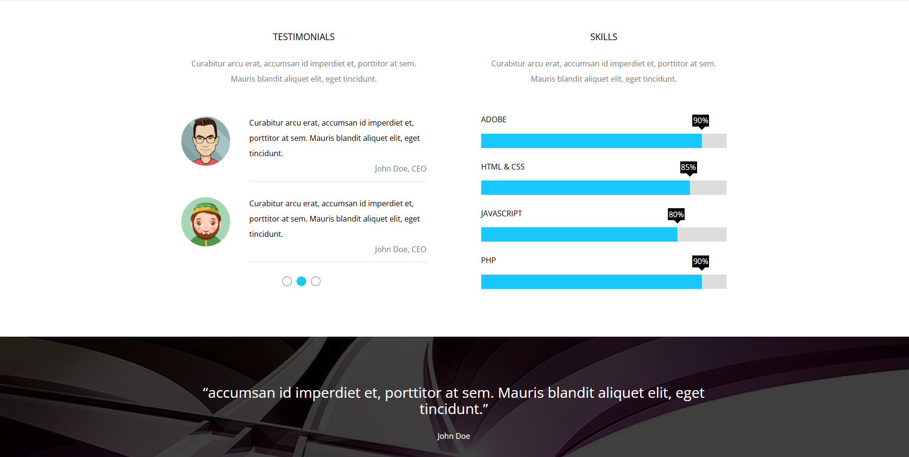 |

| Contact 1                               | Contact 2                               | Footer                            |
| --------------------------------------- | --------------------------------------- | --------------------------------- |
| 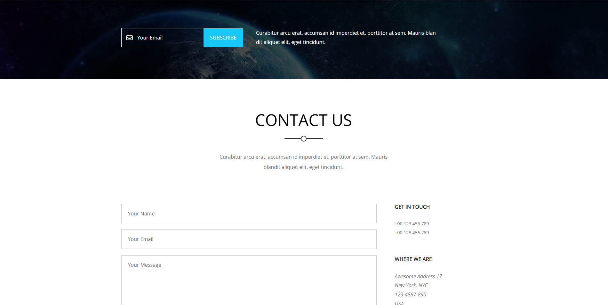 | 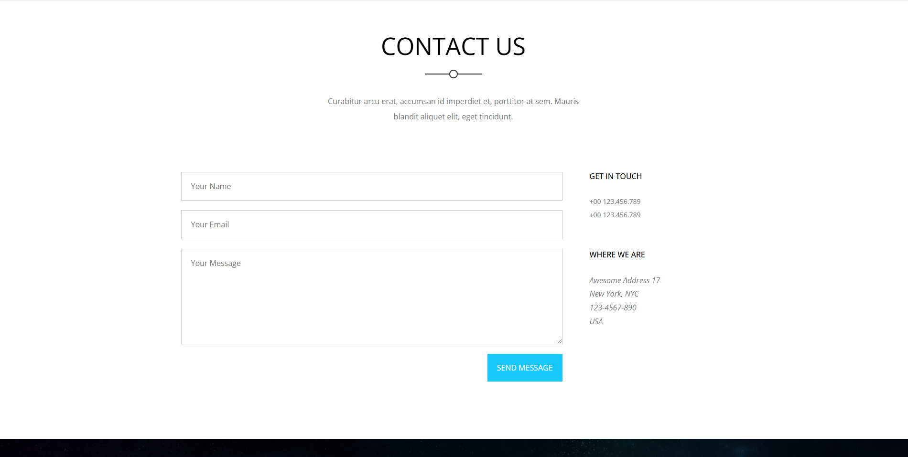 | 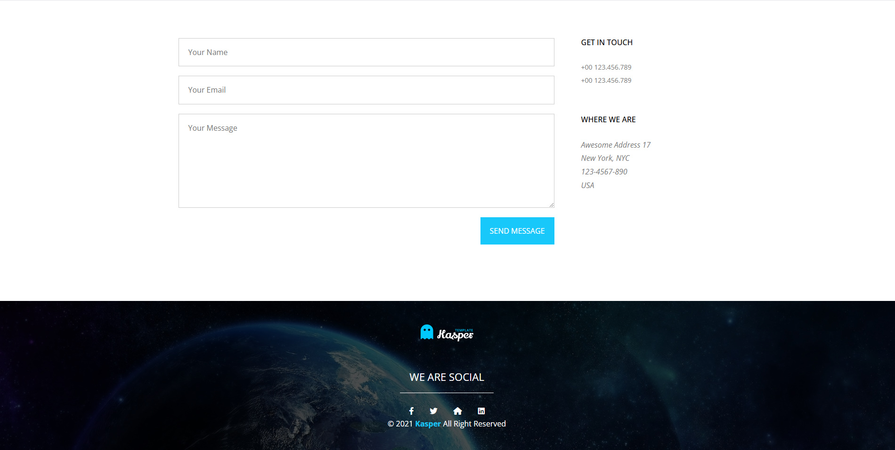 |

### Mobile

| Mobile View                       |
| --------------------------------- |
| 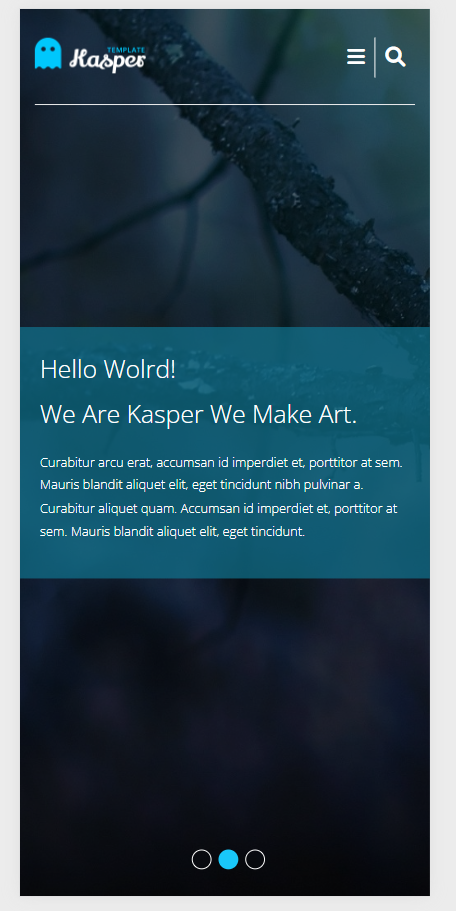 |

> Screenshots show the template’s **responsive and clean design** across desktop and mobile devices.

---

## 🛠️ Technologies

- HTML5
- CSS3
- Responsive Design

---

## 🚀 Usage

1. **Clone the repository**

   ```bash
   git clone https://github.com/YoussefAdel170/Kasper-Template.git

   ```

2. **Navigate into the project directory**
   ```bash
   cd Kasper-Template
   ```
3. Open **index.html** in your browser.
